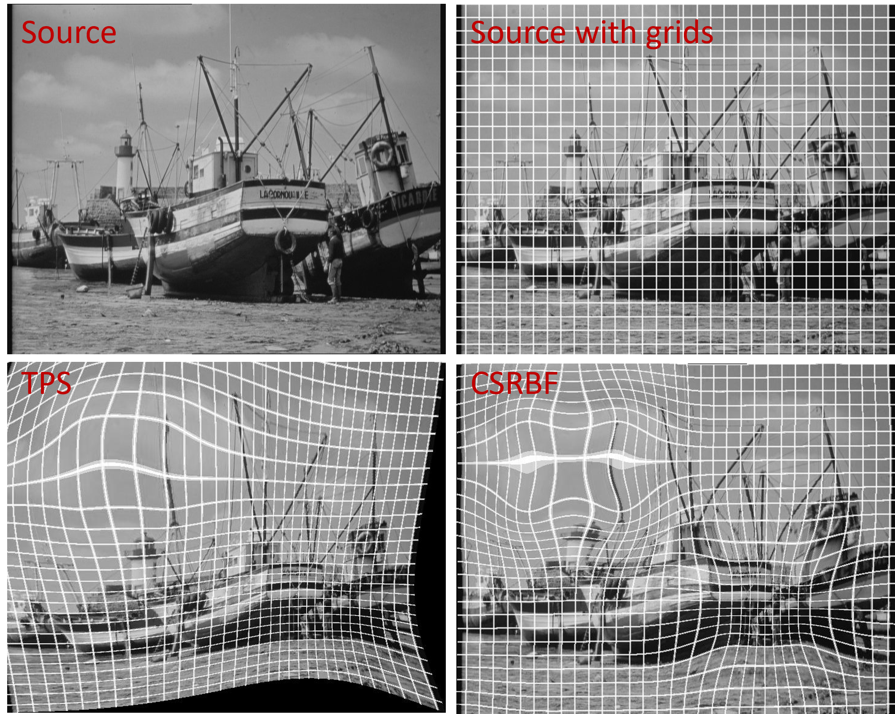

# Image Warping with TPS and CSRBF

This repository provides a simple framework for flexible image registration and warping using two common methods:

- **Thin Plate Splines (TPS)**  
- **Compactly Supported Radial Basis Functions (CSRBF)**  

The design follows an object-oriented pattern, with a shared `BaseTransform` class and specialized subclasses (`TPSTransform`, `CSRBFTransform`).  
This makes it easy to extend with additional warping methods.

---

## Usage
```python
from skimage.io import imread, imsave
from Transform import TPSTransform, CSRBFTransform

img = imread("boats_grid.jpg")
h, w = img.shape
anchor = [[0,0], [w, 0], [0, h], [w, h]] # anchor at four corner of image

# expand and shrink at two location
src = [[145, 130], [220, 130], [145, 180], [220, 180], [410, 317], [604, 314], [413, 471], [605, 472]]
dst = [[115, 90],  [265, 90],  [115, 245], [270, 245], [445, 350], [570, 350], [445, 445], [570, 445]]
src += anchor
dst += anchor

tps = TPSTransform()
warped = tps.transform(img, src, dst, order=0)
imsave("boats_tps.jpg", warped)

csrbf = CSRBFTransform(200)
warped = csrbf.transform(img, src, dst, order=0)
imsave("boats_csrbf.jpg", warped)
```



## Citations
1. [Skimage ThinPlateSplineTransform](https://scikit-image.org/docs/0.25.x/auto_examples/transform/plot_tps_deformation.html)
2. [Principal warps: Thin-plate splines and the decomposition of deformations](https://ieeexplore.ieee.org/abstract/document/24792)
3. [Radial basis functions with compact support for elastic registration of medical images](https://www.sciencedirect.com/science/article/abs/pii/S0262885600000573)